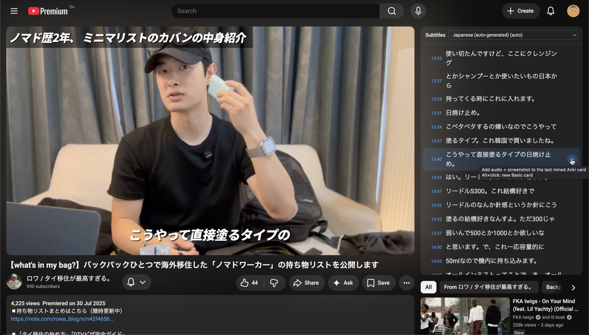

# Freegaku



A Chrome (MV3) extension for mining Anki cards from **YouTube** and **Netflix**:
a subtitle sidebar next to the video (works with real and auto-generated
captions), click a line's **＋** to attach the sentence audio, a screenshot,
the sentence text, and a source link to the Anki card you just created with
[Yomitan](https://yomitan.wiki). See [SPEC.md](SPEC.md) for the full design and
[docs/netflix.md](docs/netflix.md) for the Netflix internals.

## From clone to installed extension

### Prerequisites

- **Node.js ≥ 20** and **pnpm** (`corepack enable` gives you pnpm)
- **Anki** with the **AnkiConnect** add-on (code `2055492159`), running while you mine
- **Yomitan** for the main workflow (Freegaku enriches the note Yomitan creates)

### 1. Build

```sh
git clone https://github.com/c-ehrlich/freegaku.git
cd freegaku
pnpm install
pnpm build
```

This emits the extension to `apps/extension/dist/chrome-mv3/` — the folder you
load in the next step. (`dist/` is not checked in; nothing to load until you
build.)

### 2. Install (Chrome / Brave / any Chromium)

1. Open `chrome://extensions` (or `brave://extensions`).
2. Enable **Developer mode** (top right).
3. Click **Load unpacked** and select `apps/extension/dist/chrome-mv3` (created
   by the build step above).

After pulling changes: `pnpm build`, then click the **↻ reload** button on the
extension's card (the browser caches the manifest until you do).

### Configure

Right-click the Freegaku toolbar icon → **Options** (opens in a tab):

- **Anki** — AnkiConnect URL + connection test.
- **Card mapping** — per note type, choose which Anki field receives the
  sentence audio / image / sentence text / origin. The ＋ button updates the
  newest note of one of these types.
- **Quick cards** — deck + note type for standalone cards (Front = text you
  type, Back = sentence + audio + screenshot + origin).
- **Hotkeys / Capture** — toggle keys, audio padding, screenshot size.

### Use

| Action | How |
|---|---|
| Toggle sidebar / overlay | `Alt+G` / `Alt+S` |
| Mine a line | mine the word with Yomitan (hover text in the sidebar), then click the line's **＋** |
| Mine current line | `Alt+M` (rebindable at `chrome://extensions/shortcuts`) |
| Precisely mine selected text | drag-select within one line or across lines → **Adjust & add** → trim audio and choose the screenshot frame |
| Quick standalone card | `Alt`+click a **＋** |

The row **＋** remains a one-step add using the configured padding and midpoint
screenshot. The timing editor opens only after a text drag-selection.

**Netflix:** press `Alt+M` once per browser session before mining — tab
capture (how audio is recorded under DRM) requires that one explicit
invocation; after it, the ＋ buttons work normally.

## Development

```sh
pnpm dev          # dev build + auto-launched browser (see note below)
pnpm test         # subtitle parser tests (vitest)
pnpm typecheck
```

`pnpm dev` launches a browser via `web-ext`. Branded Chrome ≥ 137 removed
`--load-extension`, so point it at Chrome for Testing with a (gitignored)
`apps/extension/web-ext.config.ts`:

```ts
import { resolve } from 'node:path';
import { defineWebExtConfig } from 'wxt';

export default defineWebExtConfig({
  binaries: {
    chrome: '/path/to/Google Chrome for Testing.app/Contents/MacOS/Google Chrome for Testing',
  },
  chromiumProfile: resolve('.chrome-profile'),
  keepProfileChanges: true,
});
```

(Install Chrome for Testing with
`npx @puppeteer/browsers install chrome@stable`.) Loading the production build
unpacked into your everyday browser works fine without any of this.

## Layout

```
apps/extension/      WXT MV3 extension (content scripts, background, options UI)
packages/subtitles/  Pure-TS subtitle parsers (YouTube srv3, Netflix WebVTT)
docs/netflix.md      How the Netflix integration works + fragility notes
SPEC.md              Full product/architecture spec
```
